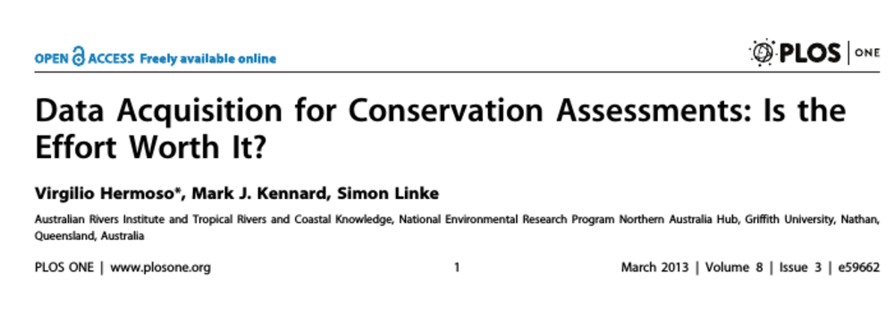
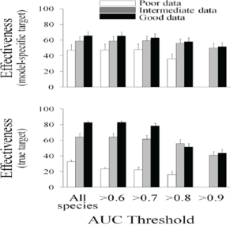
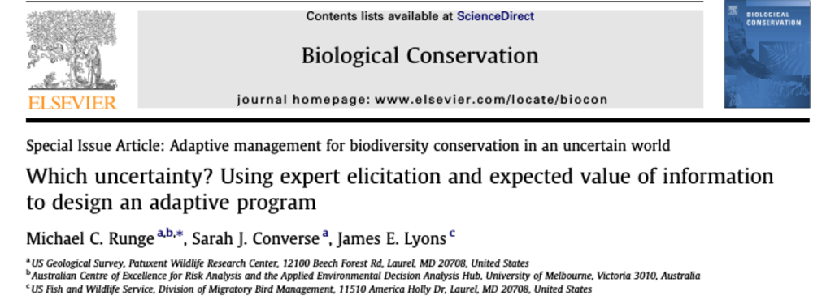
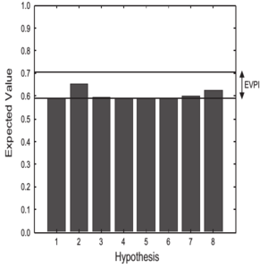

```{r setup, include=FALSE}
options(htmltools.dir.version = FALSE)
library(dplyr)
```

# Value of information (VOI)

???

Thanks for coming

Talk too quietly let me know

Ask questions during talk if I don't make sense

Today will talk about narrow but important part of decision science


--
- .font120[Both a concept and a formal decision theoretic toolset]


???

Both a rigidly defined set of formal tools used in decision analysis also a more broad philosophy, can use to think about information and learning in context of decision making

--
- .font120[In context of decision making, information has some finite value]


???

VOI presupposes information has finite value can be compared and contrasted with the cost of information, and payoffs and losses of ultimate decision


--
- .font120[Can tell you whether to seek new information, how much, and what kind]


???

VOI is implicit acknowledgement of the decisioness of investing in learning 

Tools we have to assess how to make good decision can be applied to learning ahead of time

--
- .font120[Implies some uncertainty is critical to decision making and some is not]

.center[

]
???

Critical information can change the decision made and the value of its outcome

Non-critical information does not change the decision made regardless of its content,c by definition has no value.


---
# My VOI work

???

The work I have been doing on VOI is to examine and extend it's use in the conservation sciences 

--
- .font120[Value of information for management of box-ironbark woodlands]


???

Calculated VOI in the context of managing box-ironbark forests in Victoria

--
- .font120[Value of information for spatial conservation planning]


???

Demonstrated how you can calculate the VOI for reserve design

--
- .font120[Value of information for conservation auctions]


???

Explored ways of valuing information to optimise conservation auctions

--
- .font120[Value of information and risk tolerance]


???

Addressed the issue risk tolerance and it's effect on the value of information

---
# My VOI work

- .grey[.font120[Value of information for management of box-ironbark woodlands]]


- .red[.font120[Value of information for spatial conservation planning]]


- .grey[.font120[Value of information for conservation auctions]]


- .red[.font120[Value of information and risk tolerance]]


.center[


]

???

Today just want to focus on these two pieces of work

---
class: inverse, center, middle

# Part 1: Value of information
## A little background & theory

???

Before I do. I'll just briefly touch on the theory of value of information for the benefit of those who may not be familiar

---
# Formal VOI

???

VOI is not new, it has been around since at least the 40s or 50s

--
## Expected Value of Information (EVI)

???

VOI almost always an expected value. Value from decision expected. sum of the outcomes weighted by their probability of happening

--
Difference between:
- Expected value of making decision with __original__ information (EVWOI)

and the

- Expected value of making decision with __new__ information (EVWNI)

</br>
</br>
$\Large\mathrm{EVI} = \mathrm{EVWNI} - \mathrm{EVWOI}$

???

VOI is the magnitude of the difference between these two expected values

---
# Formal VOI

## Expected Value With Original Information (EVWOI)

???

start with 2nd component

expected value of making the decision without resolving any uncertainty

--
$\Large\mathrm{EVWOI} = \max_a\mathrm{E}_\theta[v(a,\theta)]$

$\Large a$ = actions, alternatives etc

$\Large\theta$ = uncertainty, model, system state


???

First calculate the expected values of taking each  action and choose (maximise) the one with greatest expected outcome

(A) represents the actions you can take

(Theta) represents the uncertainty you have in the outcomes of those actions

---
# Formal VOI
## Many Forms of VOI


???

EVWOI is common to all of them
--
$\Large\mathrm{EV?I} = \mathrm{EVW?I} - \mathrm{EVWOI}$


???

What matters is the "new" information component

--
## Expected Value of Perfect Information (EVPI)


???

For example we can calculate the value of perfect information

--
$\Large\mathrm{EVPI} = \mathrm{EVWPI} - \mathrm{EVWOI}$

???

Which is the difference between the expected value with no uncertainty and the expected value with the original level of uncertainty

--

$\Large\mathrm{EVPI} = \mathrm{E}_\theta\max_a[v(a,\theta)] - \max_a\mathrm{E}_\theta[v(a,\theta)]$

???

EVWPI is only slightly different to EVWOI

just reverse the expectation and maximisation

Across the uncertainty find the action that maximisises value each time assuming certainty and then take the expectation of those values 

EVPI is the UPPER BOUND

---
background-image: url(https://i.imgur.com/9SBK2d2.jpg)
background-size: 200px 200px
background-repeat: no-repeat
background-position: top right

# An example 

--
- .font130.width90[Manager responsible for endangered species]

--
- .font130[Currently 10 breeding pairs, but declining]

--
- .font130[Must choose whether or not to restore habitat]

--
- .font130[50% chance that restoration will be a success]

--
- .font130[Expected number of breeding pairs:]

</br>
.font110[

| Action     | Failure | Success | _EV_ |
|:-----------|:-------:|:-------:|:----:|
| Do nothing |    8    |    8    | _8_  |
| Restore    |    5    |    15   | _10_ |
]

--
</br>
</br>
$\Large\mathrm{EVWOI} = \max_a\mathrm{E}_\theta[v(a,\theta)]$

???


---
count: false
background-image: url(https://i.imgur.com/9SBK2d2.jpg)
background-size: 200px 200px
background-repeat: no-repeat
background-position: top right

# An example

.font130[
- Manager responsible for endangered species
- Currently 10 breeding pairs, but declining
- Must choose whether or not to restore habitat
- 50% chance that restoration will be a success
- Expected number of breeding pairs:
]

</br>
.font110[

| Action     | Failure | Success | _EV_ |
|:-----------|:-------:|:-------:|:----:|
| Do nothing |    8    |    8    | .red[_8_]  |
| Restore    |    5    |    15   | .red[_10_] |
]
</br>
</br>
$\Large\mathrm{EVWOI} =\max_a$ .font150[(.red[8], .red[10])]

???


---
count: false
background-image: url(https://i.imgur.com/9SBK2d2.jpg)
background-size: 200px 200px
background-repeat: no-repeat
background-position: top right

# An example

.font130[
- Manager responsible for endangered species
- Currently 10 breeding pairs, but declining
- Must choose whether or not to restore habitat
- 50% chance that restoration will be a success
- Expected number of breeding pairs:
]

</br>
.font110[

| Action     | Failure | Success | _EV_ |
|:-----------|:-------:|:-------:|:----:|
| Do nothing |    8    |    8    | _8_  |
| Restore    |    5    |    15   | .red[_10_] |
]
</br>
</br>
$\Large\mathrm{EVWOI} =$ .font150.red[10]

???


---
count: false
background-image: url(https://i.imgur.com/9SBK2d2.jpg)
background-size: 200px 200px
background-repeat: no-repeat
background-position: top right

# An example

.font130[
- Manager responsible for endangered species
- Currently 10 breeding pairs, but declining
- Must choose whether or not to restore habitat
- 50% chance that restoration will be a success
- Expected number of breeding pairs:
]

</br>
.font110[

| Action     | Failure | Success | _EV_ |
|:-----------|:-------:|:-------:|:----:|
| Do nothing |    8    |    8    | _8_  |
| Restore    |    5    |    15   | .red[_10_] |
]
</br>
</br>
$\Large\mathrm{EVPI} = \mathrm{EVWPI} -$ .font150.red[10]

???


---
count: false
background-image: url(https://i.imgur.com/9SBK2d2.jpg)
background-size: 200px 200px
background-repeat: no-repeat
background-position: top right

# An example

.font130[
- Manager responsible for endangered species
- Currently 10 breeding pairs, but declining
- Must choose whether or not to restore habitat
- 50% chance that restoration will be a success
- Expected number of breeding pairs:
]

</br>
.font110[

| Action     | Failure | Success | _EV_ |
|:-----------|:-------:|:-------:|:----:|
| Do nothing |    8    |    8    | _8_  |
| Restore    |    5    |    15   | .red[_10_] |
]
</br>
</br>
$\Large\mathrm{EVPI} = \mathrm{E}_\theta\max_a[v(a,\theta)] -$ .font150.red[10]

???


---
count: false
background-image: url(https://i.imgur.com/9SBK2d2.jpg)
background-size: 200px 200px
background-repeat: no-repeat
background-position: top right

# An example

.font130[
- Manager responsible for endangered species
- Currently 10 breeding pairs, but declining
- Must choose whether or not to restore habitat
- 50% chance that restoration will be a success
- Expected number of breeding pairs:
]

</br>
.font110[

| Action     | Failure | Success | _EV_ |
|:-----------|:-------:|:-------:|:----:|
| Do nothing |    .blue[8]    |     8   | _8_  |
| Restore    |    5    |    .blue[15]   | .red[_10_] |
]
</br>
</br>
$\Large\mathrm{EVPI} = \mathrm{E}_\theta$.font150[(.blue[8], .blue[15]) - .red[10]]

???


---
count: false
background-image: url(https://i.imgur.com/9SBK2d2.jpg)
background-size: 200px 200px
background-repeat: no-repeat
background-position: top right

# An example

.font130[
- Manager responsible for endangered species
- Currently 10 breeding pairs, but declining
- Must choose whether or not to restore habitat
- 50% chance that restoration will be a success
- Expected number of breeding pairs:
]

</br>
.font110[

| Action     | Failure | Success | _EV_ |
|:-----------|:-------:|:-------:|:----:|
| Do nothing |    .blue[8]    |     8   | _8_  |
| Restore    |    5    |    .blue[15]   | .red[_10_] |
]
</br>
</br>
$\Large\mathrm{EVPI} =$ .font150[.blue[11.5] - .red[10]]

???


---
count: false
background-image: url(https://i.imgur.com/9SBK2d2.jpg)
background-size: 200px 200px
background-repeat: no-repeat
background-position: top right

# An example

.font130[
- Manager responsible for endangered species
- Currently 10 breeding pairs, but declining
- Must choose whether or not to restore habitat
- 50% chance that restoration will be a success
- Expected number of breeding pairs:
]

</br>
.font110[

| Action     | Failure | Success | _EV_ |
|:-----------|:-------:|:-------:|:----:|
| Do nothing |    .blue[8]    |     8   | _8_  |
| Restore    |    5    |    .blue[15]   | .red[_10_] |
]
</br>
</br>
$\Large\mathrm{EVPI} =$ .font150.purple[1.5]

???


---
# Implications


--
- Risk-neutral decision-maker with original information expects to maintain current population.


--
- In reality, either lose 5 or gain 5, with equal probability. But better than guaranteed loss of 2.


--
- Acting with certainty expect to gain 1.5 as can avoid the worst case of losing 5.


--
- Is therefore optimal to spend up to value of 1.5 breeding pairs worth of resources to find out! 


.center[]

???

Provided you can convert the value of 1.5 breeding pairs into the same currency as the cost of learning

---
# Formal VOI

## Expected Value of Sample Information


???

Before continuing highlight one more form of EVI

--
</br>
</br>
$\Large\mathrm{EVSI} = \mathrm{EVWSI} - \mathrm{EVWOI}$


???

The most general form of EVI, sample of information. 

That is unlike perfect information, it is not the EVI of resolving all uncertainty it is the value of only resolve a bit

--

$\Large\mathrm{EVSI} = \mathrm{E}_s[\max_a\mathrm{E}_{\theta|s}[v(a,\theta)]] - \max_a\mathrm{E}_\theta[v(a,\theta)]$


???

Without detail. in the same notation, can see there is an extra step of expectation and I introduced a term, s, to represent the sample of information. In reality this could the results of experiments or monitoring or even just a single observation

If we let the sample-size of, s, got to infinity you should be able to see that this term cancels out and this just becomes the value of perfect information

---
class: center, middle

```{r dimretplot, fig.width = 4, fig.height = 3, dev = "svg", echo = FALSE, out.width = "1200px", dev.args = list(family = "Droid Serif")}
par(mar = c(3, 3, 1, 1))
curve(x / (x + 1), 0, 10, xlab = "", xaxt = 'n', ylab = "", yaxt = "n", ylim = 0:1, lwd = 2)
abline(h = 1, lty = 2)
text(0.5, 1, "EVPI", pos = 1)
mtext("Sample-size", 1, 1)
mtext("EVSI", 2, 1)
```
???

Graphically that idea looks this. this graph also highlights a point will come back to later.

VOI in general, at least theoretically, has diminishing returns.

---
</br>
- .font130[VOI both concept and formal toolset]


???

Take home messages from part 1 

--
- .font130[Difference between value with original and new information]


--
- .font130[Many forms of EVI. But EVWOI is common to all]


--
- .font130[EVPI is the upper bound, EVSI is the general form and has diminishing returns]


.center[

]

???


---
class: inverse, center, middle

# Part 2: Value of Information in conservation and natural resource management
## How has it been used to date?

???


---
# Two flavours of VOI in conservation science

???

Don't claim this is a systematic review of the literature, this is somewhat of caricature and is my impression of the state of play from spending the last 5 years on this topic.

--

.pull-left[
## 1. Informal VOI analyses

- Don't use classic VOI (EVPI, etc.,)


- Post-hoc reevaluation of decision problems with different data


- Typically applied to spatial conservation planning (e.g., reserve network design)


- Somewhat hidden in literature as don't use a standard lexicon


]
--

.pull-right[
## 2. Formal VOI analyses 

- Use one or more forms of EVI in the strict sense


- Almost always calculate the EVPI


- Typically applied to managing a species (e.g., fishery, invasive plant)


- Easier to find in literature


]

---
# Informal VOI in conservation planning

--
- .font120[Comparison of data quantity (full vs. subset)]


--
- .font120[Comparison of data quality (fine resolution vs. coarse)]


--
- .font120[Span a wide range systems (country-wide reserve networks, forest stocks, fisheries, etc.)]


--
- .font120[Narrow objectives (maximally represent or retain distribution of biodiversity feature or achieve target level of protection)]


--
- .font120[Typically do decision making with planning software such Marxan or Zonation]


--
- .font120[Actions are: choose among a set of candidate areas for protection or other conservation action]


???


---



.pull-left[]

.pull-right[

Conservation plans for freshwater fish in northern Australia.

Plans with 15, 55, and 85% of full distribution dataset.

More than double the effectiveness of plan when using 85% compared to 15% (measured as number of species exceeding target level of protection)

]


???


---
# Formal VOI for species management

--
- .font120[Early examples often focused on commercial fisheries]


--
- .font120[Recent examples focus on wider management contexts (threatened species recovery, wildlife harvest, invasives control)]


--
- .font120[Bias towards the management of animals (some examples on the management of invasive plants)]


--
- .font120[Decision problem well formulated: objectives, alternatives, system model, etc.]


--
- .font120[Typically use a population model or sometimes expert opinion to predict outcomes]


--
- .font120[Use a variety of the forms of EVI but always at least report EVPI]


???


---



.pull-left[]

.pull-right[

Trying to maximise recruitment in population of whooping cranes

8 competing hypotheses and 7 alternative management strategies

EVPI a 20% relative improvement in performance of management

Different hypotheses have different associated partial expected value of perfect information

]


???


---
# Two flavours of VOI in conservation science

--

.pull-left[
## 1. Informal VOI analyses

- Authors of these studies tend to be positive about the value of information
 "_represent a very good conservation investment_" (Balmford 1999)

]


.pull-right[
## 2. Formal VOI Analyses 

- Authors of these studies tend to use more qualifiers to describe information value like, 
 "_modest_" (e.g., Moore 2011) or "_low_" (e.g, Johnson 2014) 

]

--

.center[
## Reasons?
]

--
- Different methods?


--
- Culture of subfields?


--
- Study selection bias?


???


---
class: center, middle

```{r dimretplotB1, fig.width = 4, fig.height = 3, dev = "svg", echo = FALSE, out.width = "1200px", dev.args = list(family = "Droid Serif")}
par(mar = c(3, 3, 1, 1))
curve(x / (x + 1), 0, 10, xlab = "", xaxt = 'n', ylab = "", yaxt = "n", ylim = 0:1, lwd = 2)
abline(h = 1, lty = 2)
text(0.5, 1, "EVPI", pos = 1)
mtext("Sample-size", 1, 1)
mtext("EVSI", 2, 1)
```
???

Returning to this graph showing that VOI has diminishing returns

---
count: false
class: center, middle

```{r dimretplotB2, fig.width = 4, fig.height = 3, dev = "svg", echo = FALSE, out.width = "1200px", dev.args = list(family = "Droid Serif")}
par(mar = c(3, 3, 1, 1))
curve(x / (x + 1), 0, 10, xlab = "", xaxt = 'n', ylab = "", yaxt = "n", ylim = 0:1, lwd = 2)
abline(h = 1, lty = 2)
text(0.5, 1, "EVPI", pos = 1)
mtext("Time", 1, 1)
mtext("EVSI", 2, 1)
```
???

For the sake of argument lets replace sample-size with time, assuming over time we accumulate information and the cumulative value of information is increasing towards perfect knowledge

---
count: false
class: center, middle

```{r dimretplotB3, fig.width = 4, fig.height = 3, dev = "svg", echo = FALSE, out.width = "1200px", dev.args = list(family = "Droid Serif")}
par(mar = c(3, 3, 1, 1))
curve(x / (x + 1), 0, 10, xlab = "", xaxt = 'n', ylab = "", yaxt = "n", ylim = 0:1, lwd = 2)
abline(h = 1, lty = 2)
abline(v = 5, lwd = 3, col = "salmon")
text(0.5, 1, "EVPI", pos = 1)
mtext("Time", 1, 1)
mtext("EVSI", 2, 1)
```
???

Lets assume that anyone of these studies occurs at some point in the middle

---
count: false
class: center, middle

```{r dimretplotB4, fig.width = 4, fig.height = 3, dev = "svg", echo = FALSE, out.width = "1200px", dev.args = list(family = "Droid Serif"), warning = FALSE}
par(mar = c(3, 3, 1, 1))
curve(x / (x + 1), 0, 10, xlab = "", xaxt = 'n', ylab = "", yaxt = "n", ylim = 0:1, lwd = 2)
abline(h = 1, lty = 2)
abline(v = 5, lwd = 3, col = "salmon")
text(0.5, 1, "EVPI", pos = 1)
text(5, .5, "Formal \u2192", pos = 4)
text(5, .5, "\u2190 Informal", pos = 2)
mtext("Time", 1, 1)
mtext("EVSI", 2, 1)
```
???

Now from the perspective of the informal information valuers: they look back in time

Whereas formal information valuers are looking at what can be learned in the future

---
count: false
class: center, middle

```{r dimretplotB5, fig.width = 4, fig.height = 3, dev = "svg", echo = FALSE, out.width = "1200px", dev.args = list(family = "Droid Serif"), warning = FALSE}
par(mar = c(3, 3, 1, 1))
curve(x / (x + 1), 0, 10, xlab = "", xaxt = 'n', ylab = "", yaxt = "n", ylim = 0:1, lwd = 2)
abline(h = 1, lty = 2)
abline(v = 5, lwd = 3, col = "salmon")
text(0.5, 1, "EVPI", pos = 1)
text(5, .5, "Formal \u2192", pos = 4)
text(5, .5, "\u2190 Informal", pos = 2)
abline(h = .8333, lty = 3)
segments(c(-.2, 10.2), c(0, .83333), c(-.2, 10.2), c(.8333, 1), lwd = 3, col = "#8c88b9")
mtext("Time", 1, 1)
mtext("EVSI", 2, 1)
```
???

Purple lines show that looking in either direction you will see quite a different VOI

I have no proof but I think in general people doing both tend to be up this end (the right).

For much the same reason.

Informal: pick a subject with lots of data so they can subset and demonstrate it's worth

Formal: picking case-studies that are on well known studies were original information is rich

---
# Problems with informal VOI


???

I think there a three problems with the informal approach. and all addressed by doing formal VOI

--
- .font120[Straw man]


--
- .font120[Tells us what we already know]


--
- .font120[Doesn't tell us what we should do now]

</br>
.center[

]


???


---
</br>
- .font130[Two flavors of VOI: Informal and formal]


???

Take home messages from part 2

--
- .font130[Informal used in conservation planning]


--
- .font130[Formal used in species population management]


--
- .font130[Formal reports low value and informal reports high]


--
- .font130[There are problems with the informal approach and conservation planning may benefit from using formal VOI]


???


---
class: inverse, center, middle

# Part 3: A Case-study
## Value of Information and spatial conservation planning

???


---
# VOI for spatial conservation planning

 
--
- .font130[Not a new idea!]


--
- .font130[Yet to see one done formally?]


--
- .font130[So how would it be done?]


--
- .font130[Need conservation plan with a clearly defined performance measure]


--
- .font130[Need to characterise the uncertainty in information used to predict the outcome]

???


---
class: bottom
background-image: url(voi-seminar_files/figure-html/simpleZon1.svg)

.font150[Threatened species unevenly distributed across landscape divided into 25 units]</br></br></br></br>

???

Imagine the numbers of represent carrying capacity or habitat suitability scores, etc.

---
count: false
class: bottom
background-image: url(voi-seminar_files/figure-html/simpleZon2.svg)

.font150[Second species with different distribution in the same landscape]</br></br></br></br>


???

Care about these two species equally 

---
count: false
class: bottom
background-image: url(voi-seminar_files/figure-html/simpleZon3.svg)

.font150[Conservation prioritization: rank each unit according to biodiversity value]</br></br></br></br>

???

Here we can use an conservation planning algorithm like Zonation or Marxan

In this case I have used Zonation with the additive benefit function.

It tries to maximize the average proportion of value remaining when removing a grid cell in reverse order

---
count: false
class: bottom
background-image: url(voi-seminar_files/figure-html/simpleZon4.svg)

.font150[Assuming budget only large enough to conserve one unit. Pick one that maximises the average remaining (species have equal weights)]</br></br></br></br>

???

When we can only afford to save one cell, just pick top rank. 

in this case we would save on average about 7 percent of each species distribution

---
count: false
class: right, middle
background-image: url(voi-seminar_files/figure-html/simpleZon5.svg)

</br></br>Uncertainty in form </br>of second possible </br>scenario for same</br>landscape

???

In reality we can't know precisely the distribution of species

we can represent the uncertainty as alternate scenarios, or map sets, which could even be weighted differently,

for now weighted equally

---
count: false
class: right, middle
background-image: url(voi-seminar_files/figure-html/simpleZon6.svg)

</br></br>Different distribution</br>= different ranking

</br></br>What is the expected</br>value of knowing</br>which scenario is</br>correct?

???


---
count: false
class: right, middle
background-image: url(voi-seminar_files/figure-html/simpleZon6.svg)

</br></br>
$\Large\mathrm{EVPI} = \mathrm{EVWPI} - \mathrm{EVWOI}$

???


---
count: false
class: right, middle
background-image: url(voi-seminar_files/figure-html/simpleZon6.svg)

</br></br>
$\Large\mathrm{EVPI} = \mathrm{EVWPI} - \max_a\mathrm{E}_\theta[v(a,\theta)]$

???


---
count: false
class: right, middle
background-image: url(voi-seminar_files/figure-html/simpleZon7.svg)

</br></br>
$\Large\mathrm{EVPI} = \mathrm{EVWPI} - \max_a$.font130[(.red[6%], )]

???

Haven't calculated the second EV yet

---
count: false
class: right, middle
background-image: url(voi-seminar_files/figure-html/simpleZon8.svg)

</br></br>
$\Large\mathrm{EVPI} = \mathrm{EVWPI} - \max_a$.font130[(.red[6%], .red[5%])]

???

ranking the according to the second scenario this time average of 5%

---
count: false
class: right, middle
background-image: url(voi-seminar_files/figure-html/simpleZon7.svg)

</br></br>
$\Large\mathrm{EVPI} = \mathrm{EVWPI} -$ .font130[.red[6%]]

???

Choose the action that maxmise. Means we can discard the 5% result.

importantly though we still had to calculate it to work out it wasn't the max

---
count: false
class: right, middle
background-image: url(voi-seminar_files/figure-html/simpleZon9.svg)

</br></br>
$\Large\mathrm{EVPI} = \mathrm{E}_\theta\max_a[v(a,\theta)] -$ .font130[.red[6%]]

???

EVWPI is actually simpler as we can just work out what we would do under each scenario and average the results 

because we have equal weighting

---
count: false
class: right, middle
background-image: url(voi-seminar_files/figure-html/simpleZon9.svg)

</br></br>
$\Large\mathrm{EVPI} = \mathrm{E}_\theta$.font130[(.blue[7%], .blue[7%]) - .red[6%]]

???


---
count: false
class: right, middle
background-image: url(voi-seminar_files/figure-html/simpleZon9.svg)

</br></br>
$\Large\mathrm{EVPI}$.font130[ = .blue[7%] - .red[6%]]

???


---
count: false
class: right, middle
background-image: url(voi-seminar_files/figure-html/simpleZon9.svg)

</br></br>
$\Large\mathrm{EVPI}$.font130[ = .purple[1%]]

???


---
class: inverse
background-size: contain
background-image: linear-gradient( rgba(0, 0, 0, 0.5), rgba(0, 0, 0, 0.5) ), url(https://upload.wikimedia.org/wikipedia/commons/7/77/43_Broke_Hunter_Valley.jpg)

# Case study: A spatial conservation plan for the Hunter Valley, NSW

???

So I have done this for a less trivial example

--
.white.font140[
- __Biodiverse region__


- __Many threatened species__


- __Multiple threats__


- __Active economic development in the region: housing, mining, transport infrastructure__


- __Ongoing interest in strategic planning and biodiversity conservation in the region__
]

???

Heini, Brendan, Amy Whitehead and others have worked extensively on this problem, and I using a stripped back version here to demonstrate how to do VOI for conservation planning.

---
class: inverse
background-size: cover
background-image: linear-gradient( rgba(0, 0, 0, 0.5), rgba(0, 0, 0, 0.5) ), url(https://c2.staticflickr.com/6/5547/14623801992_9fac537b25_b.jpg)
# Case study: A spatial conservation plan for the Hunter Valley, NSW


- .white.font140[__Chose 6 species: 2 plants; 2 mammals; 2 birds__]


???

Threatend species, all of real concern, but by no means the only species that decision makers care about 

--
- .white.font140[__Built SDMs (MaxEnt) with publically available occurrence data (30 records per species) and covariates for the Hunter Region (~40,000 1km grid cells)__]


???

Not necessarily the best way of modelling species distributions but certainly a very common method used in conservation planning

--
- .white.font140[__Bootstrapped the SDMs to characterised the uncertainty (resampling with replacement)__]


???

Equivalent to the alternative equally weighted scenarios I introduced in the example

Did 1000 per species

--
- .white.font140[__Build conservation plans protecting top 20% of landscape using uncertain SDMs__]


???

Again the same as in my toy example, ranked using additive benefit, instead assessing performance on the single top ranked grid cell performance is the value of top 20% of grid cells. Also assuming that all grid cells are available in reality the are not, houses mines, etc.

1000 bs equals 1000 plans

--
- .white.font140[__Calculate EVWOI, EVWPI and EVPI__]


???

EVWOI computationally hard cos you need to cross assess each 1000 plans against each 1000 bs species mapset = 1 million performance assessments.

---
background-image: url(http://2.bp.blogspot.com/-5OojQkKBsJs/TfIKkBNVnVI/AAAAAAAABQQ/4YC8Fj2TCPU/s1600/Regent%2Bhoneyeater%2BXanthomyza%2Bphrygia.jpg), url(https://www.uq.edu.au/news/filething/get/125532/Hidden%20Vale%20-%20spotted%20tail%20quoll.jpg), url(http://media.bowerbird.org.au/181/181183-Full800.jpg), url(https://c1.staticflickr.com/1/727/22443858838_21efba93cf_b.jpg), url(http://www.environment.nsw.gov.au/images/animals/sugarGliderLg.jpg), url(https://upload.wikimedia.org/wikipedia/commons/thumb/4/4f/Melaleuca_groveana_leaves%2C_flowers_and_fruit.jpg/1200px-Melaleuca_groveana_leaves%2C_flowers_and_fruit.jpg)
background-size: 305px 350px
background-repeat: no-repeat
background-position: 0px 0px, 305px 0px, 610px 0px, 0px 350px, 305px 350px, 610px 350px


???

Regent honeyeater: Critical endangered, on IUCN red list.

Powerful Owl: Vulnerable in NSW

Spotted-tailed Quoll: Federally Endangered and near threatened on IUCN

Squirrel Glider: Vulnerable in NSW

Bynoe's Wattle: Endangered in NSW

Grove's Paperbark: Vulnerable in NSW

---
background-image: url(voi-seminar_files/figure-html/HunterSpeciesModels.svg)

???

Here are the distribution maps based on the public occurrence data on the Atlas of Living Australia (random 30 records).

I've artificially reduced the available points so to ensure there is a measurable level of uncertainty.  

covariates used: mean solar radiation, annual mean temperature, annual precipitation, COV of precipitation, soil fertility and topographic wetness.

Not an exercise in trying to build the best model by any means
---
background-image: url(voi-seminar_files/figure-html/HunterPlan1.svg)

???

With those inputs the planning algorithm ranks sites in the west low and sites in the east high. with some low ranking cells around new castle and also along the coast. haven checked but this probably a pretty good map of existing and proposed coal mines :(

---
count: false
background-image: url(voi-seminar_files/figure-html/HunterPlan2.svg)

???

And the top 20% of those sites are these ones.

So if you ignore uncertainty and you could put reserves wherever you want over 20% of the region you'd put them here.

Ignoring a whole bunch of caveats like connectivity and the appropriateness of the objective function and missing species and other considerations.

---
# Results

???

So for this example what happens when you go through the steps of taking account of uncertainty by bootstrapping, planning based on the different map sets, cross assessing the plans and calculating the EVWOI and EVWPI


--
### EVWOI

Expected performance of plan to protect the most valuable 20% of the Hunter given uncertainty:

.red.font150[34.8%] average proportion of species carrying capacity remaining

--
### EVWPI 

Expected performance of plan given complete certainty about species distributions:

.blue.font150[35.2%]


???


---
# Results

.font150[EVPI = .purple[0.4%] (or .purple[1%] relative increase)]


--
.font120[Species with original population of 10,000 expect to protect .purple[40] more with reserve network than would otherwise]


--

</br>

|                      | EVWOI | EVWPI | EVPI | 
|:---------------------|:-----:|:-----:|:----:|
| Bynoe's Wattle       | 72.9  | 72.1  | -0.9 |
| Grove's Paperbark    | 27.8  | 28.1  | 0.2  |
| Spotted-tailed Quoll | 20.6  | 21.0  | 0.4  |
| Powerfull Owl        | 22.0  | 22.6  | 0.6  |
| Squirrel Glider      | 29.6  | 30.2  | 0.6  |
| Regent Honeyeater    | 35.9  | 37.3  | 0.9  |
</br>


???

Individual species will be expected to do better or worse on average, how worse?

With extra information we expect to be better able to trade some loss in a well protected species for greater gains in less well protected species.

Note this table still assumes we are learning everything there is to know about all species. Not one species at a time. That is called the expected value of partial perfect information. You'll have to read my thesis to see how that is done.

---
background-size: contain
background-image: url(voi-seminar_files/figure-html/HunterPlanBoot.png)

???

Again this is not a partial-perfect EVI analysis but is does hint at what the results of one be

This is a graph of every grid cell and the range of rankings it achieves across the bootstrap samples

I have ordered them by their average ranking and divided them into three groups based on whether they ever cross the 20% threshold.

---
background-size: contain
background-image: url(voi-seminar_files/figure-html/HunterPlanBootIC.png)

???

With a better color scheme and can use an awkward metaphor!! Ice cream!

---
background-image: url(voi-seminar_files/figure-html/HunterPlanZones1.svg)

???


---
count: false
background-image: url(voi-seminar_files/figure-html/HunterPlanZones2.svg)

???


---
count: false
background-image: url(voi-seminar_files/figure-html/HunterPlanZones3.svg)

???

Haven't tested it but could be a useful heuristic and has come up in some of my other VOI work

---
</br>
- .font130[Possible to do a formal VOI for a conservation plan]


???

Take home messages from part 3

--
- .font130[In Hunter region there is value of information at least for this example]


--
- .font130[Can divide landscape up into different regions: never consider, warrant learning, and definitely include]


--
- .font130[Ice cream!!]

.center[]

???


---
class: inverse, center, middle

# Part 4: Value of Information and risk
## A counter-intuitive example 


???


---
# Back to this example 

- .font110[Manager responsible for endangered species]


- .font110[Currently 10 breeding pairs, but declining]


- .font110[Must choose whether or not to restore habitat]


- .font110[Payoff matrix:]

</br>
.font110[

| Action     | Failure | Success |
|:-----------|:-------:|:-------:|
| Do nothing |    8    |    8    |
| Restore    |    5    |    15   |
]

???

Every the same as before.

--
</br>
- .font110[Now suppose the probability of failure,] $\large{}p$, .font110[varies]

???

But now the probability failure is known but variable. To be clear I am not say the manager is uncertain about how uncertain they are. I am just saying let's vary the probability and look at the effect on EVPI. 

---
```{r evpi, fig.width = 6, fig.height = 4, dev = "svg", echo = FALSE, out.width = "1200px", dev.args = list(family = "Droid Serif")}
u = function(x) 3.5 + 2 * log(x)

evpi = function (p) {
  b  = matrix(c(8, 5, 8, 15), 2)
  leave   = b[1, 1] * p +  b[1, 2] * (1 - p)
  restore = b[2, 1] * p +  b[2, 2] * (1 - p)
  evwoi   = pmax(leave, restore)

  evwpi   = b[1, 1] * p + b[2, 2] * (1 - p)
  evwpi - evwoi
}

eupi = function(p) {
 sapply(p,
   function(p) {
     if (p <= (u(8) - u(15)) / (u(5) - u(15))) {
       f = function(x) {
           (p * u(8 - x) + (1 - p) * u(15 - x)) -
           (p * u(5) + (1 - p) * u(15))
       }
     } else {
       f = function(x) {
           (p * u(8 - x) + (1 - p) * u(15 - x)) -
           u(8)
       }
     }
     uniroot(f, c(0, 8))$root
   }
 )
}

par(mar = c(4, 4, 2, 2))
curve(evpi, 0, 1, las = 1, yaxs = "i", xaxs = "i", bty = "n", ylim = c(0, 2.5),
      xlab = expression(italic(p)), ylab = "EVPI", lwd = 3)
title("EVPI vs. probability of failure")
```
???

So this is what that would look like. Won't go into the maths again.
The obvious features are that when p = 0 or 1 there is no value of information.
Makes sense because in those cases we have complete certainty 

---
count: false
```{r evpi2, fig.width = 6, fig.height = 4, dev = "svg", echo = FALSE, out.width = "1200px", dev.args = list(family = "Droid Serif")}
u = function(x) 3.5 + 2 * log(x)

evpi = function (p) {
  b  = matrix(c(8, 5, 8, 15), 2)
  leave   = b[1, 1] * p +  b[1, 2] * (1 - p)
  restore = b[2, 1] * p +  b[2, 2] * (1 - p)
  evwoi   = pmax(leave, restore)

  evwpi   = b[1, 1] * p + b[2, 2] * (1 - p)
  evwpi - evwoi
}

eupi = function(p) {
 sapply(p,
   function(p) {
     if (p <= (u(8) - u(15)) / (u(5) - u(15))) {
       f = function(x) {
           (p * u(8 - x) + (1 - p) * u(15 - x)) -
           (p * u(5) + (1 - p) * u(15))
       }
     } else {
       f = function(x) {
           (p * u(8 - x) + (1 - p) * u(15 - x)) -
           u(8)
       }
     }
     uniroot(f, c(0, 8))$root
   }
 )
}

par(mar = c(4, 4, 2, 2))
curve(evpi, 0, 1, las = 1, yaxs = "i", xaxs = "i", bty = "n", ylim = c(0, 2.5),
      xlab = expression(italic(p)), ylab = "EVPI", lwd = 3)
segments(c(0, .5), c(1.5, 1.5), c(.5, .5), c(1.5, 0), lty = 2, lwd = 3)
title("EVPI = 1.5 when p = .5")
```
???

Second thing is we can see that when p = .5 EVPI is 1.5 which is the same answer we got before.

---
count: false
```{r evpi3, fig.width = 6, fig.height = 4, dev = "svg", echo = FALSE, out.width = "1200px", dev.args = list(family = "Droid Serif")}
u = function(x) 3.5 + 2 * log(x)

evpi = function (p) {
  b  = matrix(c(8, 5, 8, 15), 2)
  leave   = b[1, 1] * p +  b[1, 2] * (1 - p)
  restore = b[2, 1] * p +  b[2, 2] * (1 - p)
  evwoi   = pmax(leave, restore)

  evwpi   = b[1, 1] * p + b[2, 2] * (1 - p)
  evwpi - evwoi
}

eupi = function(p) {
 sapply(p,
   function(p) {
     if (p <= (u(8) - u(15)) / (u(5) - u(15))) {
       f = function(x) {
           (p * u(8 - x) + (1 - p) * u(15 - x)) -
           (p * u(5) + (1 - p) * u(15))
       }
     } else {
       f = function(x) {
           (p * u(8 - x) + (1 - p) * u(15 - x)) -
           u(8)
       }
     }
     uniroot(f, c(0, 8))$root
   }
 )
}

par(mar = c(4, 4, 2, 2))
curve(evpi, 0, 1, las = 1, yaxs = "i", xaxs = "i", bty = "n", ylim = c(0, 2.5),
      xlab = expression(italic(p)), ylab = "EVPI", lwd = 3)
segments(c(0, .7), c(2.1, 2.1), c(.7, .7), c(2.1, 0), lty = 2, lwd = c(1, 3))
title("EVPI is maximal when p = .7")
```
???

But EVPI can get higher than that.

It is maximal at p = .7. Which is a little counter intuitive because that seems like a greater level of certainty.

---
count: false
```{r evpi4, fig.width = 6, fig.height = 4, dev = "svg", echo = FALSE, out.width = "1200px", dev.args = list(family = "Droid Serif"), warning = FALSE}
u = function(x) 3.5 + 2 * log(x)

evpi = function (p) {
  b  = matrix(c(8, 5, 8, 15), 2)
  leave   = b[1, 1] * p +  b[1, 2] * (1 - p)
  restore = b[2, 1] * p +  b[2, 2] * (1 - p)
  evwoi   = pmax(leave, restore)

  evwpi   = b[1, 1] * p + b[2, 2] * (1 - p)
  evwpi - evwoi
}

eupi = function(p) {
 sapply(p,
   function(p) {
     if (p <= (u(8) - u(15)) / (u(5) - u(15))) {
       f = function(x) {
           (p * u(8 - x) + (1 - p) * u(15 - x)) -
           (p * u(5) + (1 - p) * u(15))
       }
     } else {
       f = function(x) {
           (p * u(8 - x) + (1 - p) * u(15 - x)) -
           u(8)
       }
     }
     uniroot(f, c(0, 8))$root
   }
 )
}

par(mar = c(4, 4, 2, 2))
curve(evpi, 0, 1, las = 1, yaxs = "i", xaxs = "i", bty = "n", ylim = c(0, 2.5),
      xlab = expression(italic(p)), ylab = "EVPI", lwd = 3)
segments(c(.7), c(2.1), c(.7), c(0), lty = 2, lwd = c(3))
text(.7, 2.2, "\u2190 Restore", pos = 2)
text(.7, 2.2, "Do Nothing \u2192", pos = 4, xpd = NA)
title("EVPI is maximal at point of indifference")
```

???

What this point represents is the point of indifference

decision maker is indifferent about which action they should take.

When the probability of failure is below they would chose to restore

Higher; and they would do nothing.

--
$\Large{} 5p + 15(1 - p) = 8p + 8(1 - p)$

EV(restore) = EV(do nothing)


???

This is the point where p satisfies this equality:

that expected values are equal to one another

---
# Risk tolerance

--
- Risk-neutral indifferent to uncertainty in payoff; only care about expected value


--
- Risk-averse sensitive to uncertainty in payoff; prefer the guarantee of small reward (or loss) over potential for large reward if might endure large loss


--
- e.g., risk averse prefer to do nothing and ensure 8 rather than risk only having 5 even if the expected value is 10


--
- Usually conservation decision makers are assumed to be risk-neutral. Not realistic?


--
- So how does this effect value of information?


--
- Since risk averse don't like uncertain outcomes, can assume risk-averse will value information more than risk neutral?  


???


---
```{r utility, fig.width = 6, fig.height = 4, dev = "svg", echo = FALSE, out.width = "1200px", dev.args = list(family = "Droid Serif")}
par(mar = c(4, 4, 2, 2))
u = function(x) 3.5 + 2 * log(x)
curve(I, 0, 15, las = 1,  las = 1, bty = "l", xlab = "",
      ylab = "", lwd = 3)
curve(u, lty = 3, lwd = 3, add = TRUE)
legend(0, 15, c("Risk neutral", "Risk averse"), lty = c(1, 3), bty = "n")
mtext("Value", 1, 3)
mtext("Utility", 2, 3)
title("Utility vs. Value")
```

???

Before try to answer that question need to introduce the concept of utility

Think of utility as the perception of value. 

A risk neutral decision maker exhibits 1 to 1 relationship they perceive value as value and only care about maximising there expected value when making a decision

someone who is risk-averse, perceives diminishing returns with value and importantly the perceive high value has having comparably lower utility compared to a risk neutralists

---
```{r eupi, fig.width = 6, fig.height = 4, dev = "svg", echo = FALSE, out.width = "1200px", dev.args = list(family = "Droid Serif")}
u = function(x) 3.5 + 2 * log(x)

evpi = function (p) {
  b  = matrix(c(8, 5, 8, 15), 2)
  leave   = b[1, 1] * p +  b[1, 2] * (1 - p)
  restore = b[2, 1] * p +  b[2, 2] * (1 - p)
  evwoi   = pmax(leave, restore)

  evwpi   = b[1, 1] * p + b[2, 2] * (1 - p)
  evwpi - evwoi
}

eupi = function(p) {
 sapply(p,
   function(p) {
     if (p <= (u(8) - u(15)) / (u(5) - u(15))) {
       f = function(x) {
           (p * u(8 - x) + (1 - p) * u(15 - x)) -
           (p * u(5) + (1 - p) * u(15))
       }
     } else {
       f = function(x) {
           (p * u(8 - x) + (1 - p) * u(15 - x)) -
           u(8)
       }
     }
     uniroot(f, c(0, 8))$root
   }
 )
}

par(mar = c(4, 4, 2, 2))
curve(evpi, 0, 1, las = 1, yaxs = "i", xaxs = "i", bty = "n", ylim = c(0, 2.5),
      xlab = expression(italic(p)), ylab = "Expected utility of information", lwd = 3)
curve(eupi, 0.001, 1, lty = 3, lwd = 3, add = TRUE)
legend(0, 2.5, c("Risk neutral", "Risk averse"), lty = c(1, 3), bty = "n")
title("EUPI vs. probability of failure")
```
???

So with this in mind we can think about the same problem in terms of expected utility of information

The risk neutral has the same outcome as we'd expect

Non-linear utility (one from previous graph) leads to non-linear relationship between p and EUPI

Looks like the relationship in general is true that risk aversity increases the value of information. Peak is higher and the area under the curve is larger.

But it is not as simple as that?? there is no trivial part of the graph were risk-neutral sees information value as greater.

The utility has shifted the point of indifference to the left.

When the risk-averse decision maker is a position of staying with the safe bet of doing nothing, they are often less willing to want to invest in learning more about the probability of than the risk neutral decision maker would be 

---
</br>
- .font130[Value of information greatest when we have no idea what to do (expected utility of options is equal)]


--
- .font130[Risk tolerance affects what the maximal value of information is]


--
- .font130[Risk aversity can make information more valuable]


--
- .font130[But in certain circumstances it can mean it is relatively less valuable]


--
.center[]

???


---
# Thank you

.font130[Peter Vesk, Michael Runge and Hugh Possingham]


.font120[Heini Kujala, Cindy Hauser, Paul Armsworth, Michael McCarthy, Alana Moore, José Lahoz-Monfort]

</br>
.center[]

